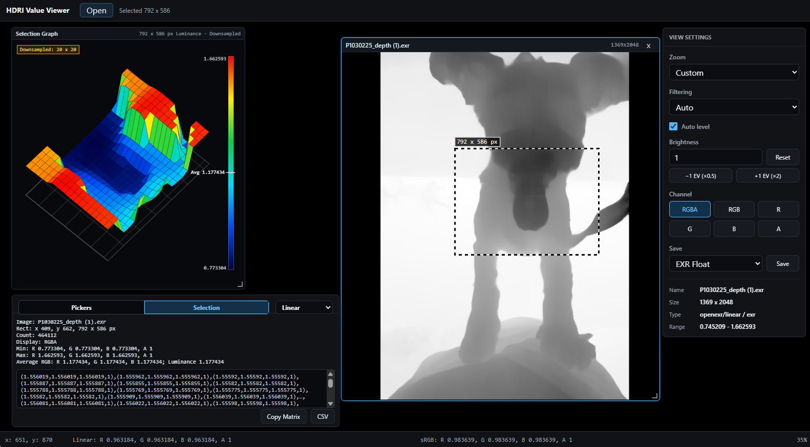
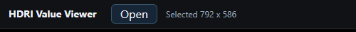
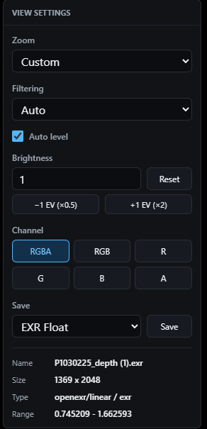
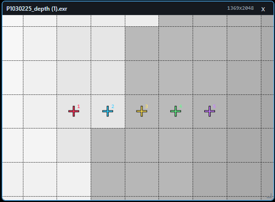
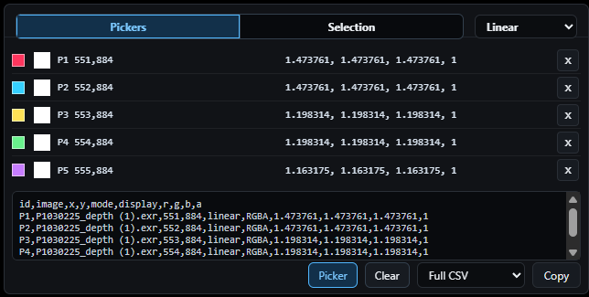
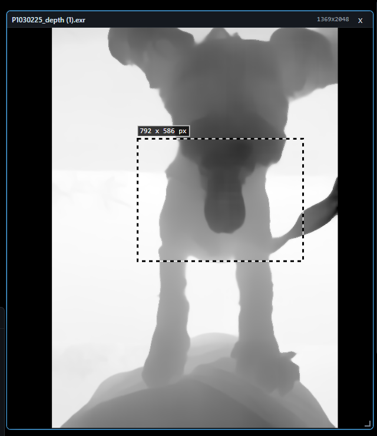
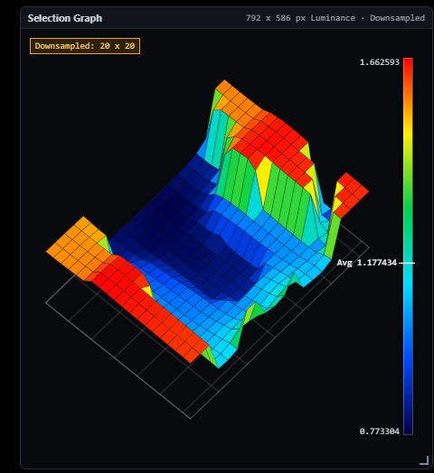
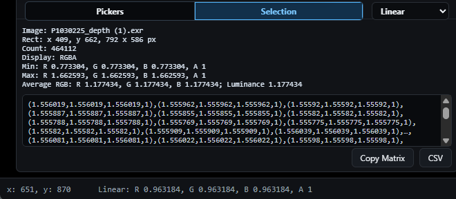
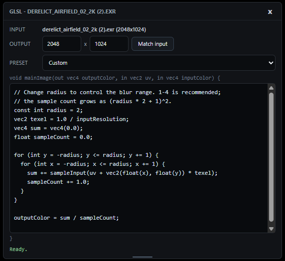

# HDRI Value Viewer


https://github.com/user-attachments/assets/53fd2ff5-9d39-4b50-b34e-35220dcfc0dd


ブラウザだけで動く HDR / EXR 等の画像の値を計測するためのビューア。

https://tomosud.github.io/hdri_view/




## できること

- PNG / JPEG / WebP / AVIF / GIF / BMP / **JPEG 2000 (JP2/J2K, 1/3ch, 1〜16bit)** / **TIFF / BigTIFF（LZW・Deflate・PackBits・JPEGなど）** に加え、**HDR (Radiance)** / **EXR (OpenEXR)** をブラウザ上でそのまま開ける
- 16,777,216画素を超える非インターレース8/16bit Gray / Gray+Alpha / RGB(A) PNGは、Worker内で元ビット深度の512pxタイルへストリーム展開し、原寸のまま表示する
- 通常表示は512pxタイルとズーム率に応じたMipレベルだけを生成・LRUキャッシュし、巨大な表示用Canvasを作らない
- カーソル位置の **linear値 / sRGB値** をステータスバーにリアルタイム表示
- 複数の画像をウィンドウとして並べて比較
- 任意の点をピックしてリストに記録、CSV としてコピー
- 矩形選択した範囲の最小・最大・平均値と、値の分布を **3Dグラフ** で可視化
- 開いた画像を PNG / JPEG / WebP、HDR 画像は HDR RGBE / EXR Float として保存
- **GLSL** を書いて画像を加工、またはコードだけから任意サイズの画像を生成

## 使い方

### 1. 画像を開く



左上の **Open** ボタンからファイルを選択するか、画面上に画像をドラッグ＆ドロップします。複数選択すると、それぞれがウィンドウとして開きます。

### 2. 表示設定を調整する



画像ウィンドウを選択すると、右側の **VIEW SETTINGS** パネルで以下を調整できます。

- **Zoom**: Fit / 100%〜3200% の固定倍率
- **Filtering**: Auto / Nearest / Linear（拡大時の補間）
- **Auto level**: HDR画像の輝度を自動でレベル補正
- **Brightness**: 露出値を数値入力、または ±1 EV ボタンで調整
- **Channel**: RGBA / RGB / R / G / B / A の表示切り替え。**RGBA を選んでいる間は、Picker /
  Selection / ステータスバーが返す RGB 値に alpha を乗算します**（黒背景と合成された、
  実際に画面で見えている値に合わせるため）。alpha を掛けない素の値が欲しいときは **RGB** を選びます
- **Save**: 表示中の画像を各フォーマットで保存（HDR/EXRはHDRI画像のみ）

パネル下部には開いている画像の **Name / Size / Type / Range**（値域）も表示されます。

### 3. ピクセル値を調べる（Picker）



**Pickers** タブで Picker ボタンを有効にし、画像上をクリックすると座標に番号付きのマーカーが打たれます。



打った点は一覧に linear 値（R, G, B, A）とともに記録され、**Copy** で CSV としてコピーできます（Full CSV / Values only を選択可）。ステータスバーには常にカーソル位置の linear / sRGB 値が表示されます。

### 4. 範囲選択して分布を見る（Selection）



画像上をドラッグすると矩形範囲を選択できます。**Selection Graph** パネルに、選択範囲の値（輝度）を高さで表した3Dグラフが自動的に描画されます。



グラフはダウンサンプルされたグリッド単位で表示され、カラースケールと Min / Avg / Max が確認できます。



**Selection** タブでは選択範囲の Rect / Count / Min / Max / Average（RGB・Luminance）が数値で確認でき、生の値マトリクスを **Copy Matrix** または **CSV** で書き出せます。

### 5. 画像・HDR値・数値マトリクスをコピー／ペーストする

画像上で範囲選択して `Ctrl+C` すると、その範囲の **linear RGBA Float32値**をコピーします。
LDR画像では外部アプリ向けのPNGも同時にクリップボードへ入りますが、このツールへ戻して貼り付ける場合は
精度を失わない値データを優先します。

OS標準のクリップボードには、linear Float32 HDR画像の共通形式がありません。このツールでは
`text/plain` 上の自己記述形式 **HDRI Value Matrix** を使用します。独自MIMEではないため普通の
テキストとして保存・受け渡しでき、先頭行によって本ツールが識別します。

```text
HDRI_VIEWER_VALUE_MATRIX 1
{"width":2,"height":1,"channels":["R","G","B","A"],"encoding":"linear",...}
data:
(2.5,0.25,0.125,1),(0,1,4,1),
```

Selection の **Copy Matrix** もこの完全形式をコピーするため、そのまま `Ctrl+V` で画像として
貼り付けられます。ヘッダーのない次のような値だけのマトリクスも、linear値として貼り付けできます。

```text
(2.5,0.25,0.125,1),(0,1,4,1),
(1,0,0,1),(0,1,0,1),
```

スカラーだけの行列はグレースケール、2〜4要素のタプルは RG / RGB / RGBA として解釈します。
HDRI Value Matrix は寸法、チャンネル、linear / sRGB、alpha乗算状態を保持し、貼り付け時にlinear RGBAへ
戻します。貼り付けた値画像は PNG / JPEG / WebP / HDR / EXR で保存できます。

貼り付け候補が同時に存在する場合の優先順位は次のとおりです。

1. HDRI Value Matrix
2. 外部の画像ファイル／画像データ
3. ヘッダーのない数値マトリクス
4. クリップボードAPIが外部データを公開せず、追加読み取りも利用できない場合だけページ内のコピー値

これにより、PNGと精密値を同時に持つ本ツール由来のコピーは1枚の精密値画像になり、外部アプリ由来の
画像に付随テキストがあっても画像を優先します。`.hdr` / `.exr` ファイルがクリップボードにある場合は
ファイルとして読み込みます。外部アプリが8bit PNGなどの画面画像しかクリップボードへ渡さない場合、
元のHDR値はクリップボード上に存在しないため復元できません。

通常のpasteイベントが画像型を示しているのにFileを渡さない場合は、非同期Clipboard APIを追加で試します。
Radiance HDR / OpenEXR はMIMEまたはファイル先頭シグネチャから判定します。この追加読み取りは画像候補が
示された場合、またはpasteイベントの型情報が空の場合だけで、通常のテキスト操作では行いません。

ページ内参照を別タブで貼り付けるなど、精密値を解決できない場合でもPNGが同時に存在すればPNGへ
フォールバックします。HDR値に代替画像が無い場合は、精度を黙って落とさずエラーを表示します。

通常の `Ctrl+C` ではUI停止を避けるため、512 x 512ピクセルを超える値は同じページ内で使える参照形式に
します。大きな範囲を可搬テキストとしてコピーする場合は Selection の **Copy Matrix** を使います。
巨大文字列による停止を避けるため、可搬Value Matrixは最大1,048,576ピクセルです。この上限は
Value Matrixだけに適用されます。ページ内参照を含む通常コピーは最大8,388,608ピクセルです。
外部HDR/EXRファイルや通常の画像表示には、これらのクリップボード上限は適用されません。

### 6. GLSL で加工・生成する



既存画像を加工する手順は次のとおりです。

1. 画像ウィンドウを選択し、タイトルバーの **GLSL** タブを押します。初回は元画像をそのまま返す
   Passthrough シェーダが作られ、同じウィンドウ内でGLSL結果へ切り替わります。
2. **OUTPUT** に出力解像度を入力します。元画像と同じサイズに戻す場合は **Match input** を押します。
3. **PRESET** からひな形を選ぶか、コード欄へ直接GLSLを書きます。入力を止めて300ms後に自動実行され、
   実行ボタンを押さずに結果が更新されます。
4. 画像ウィンドウの **Original / GLSL** を切り替えて、元画像と結果を比較します。GLSLは元画像を
   書き換えません。

**INPUT** には参照中の元画像、**OUTPUT** にはGLSL結果の解像度、**PRESET** には現在のひな形が
表示されます。トップバーの **New Image** を押すと入力画像なしでコードから画像を生成できます。
この場合、作成された画像ウィンドウは元画像を持たないため **GLSL** のみです。

**New Image** で作った画像を選択している間は、GLSLコードと出力解像度がURL末尾の `#glsl=...` に
Base64URL形式で入ります。コード、解像度、プリセットを変更するたびに同じURLが更新され、URLを開いた
相手側ではその設定から画像を再生成します。新しいタブだけでなく、既に開いている同じページへURLを
貼り付けた場合も再生成します。元画像の画素はURLへ含めないため、入力画像を加工したGLSL、
**Original** 表示、画像の無い背景を選んだ場合は通常のURLへ戻ります。

GLSL表示中の画像ウィンドウを選択している間だけエディターが現れます。**Original**、別ウィンドウ、
または画像の無い背景を選ぶと隠れます。右上の **x** で一時的に閉じることもできます。タイトルバーを
ドラッグすると移動、ダブルクリックすると折り畳み、下端のグリップを上下へドラッグするとコード欄の
高さを変更できます。位置と高さはセッションに保存されます。

コンパイルや実行に失敗した場合は直前に成功した画像を残し、エラーのある編集中コードも保持します。

書くのは以下の関数の中身だけで、`outputColor` に代入します。

```glsl
void mainImage(out vec4 outputColor, in vec2 uv, in vec4 inputColor) {
    // ここを書く
    outputColor = inputColor;
}
```

| 名前 | 内容 |
| --- | --- |
| `outputColor` | 出力先。代入する（再宣言しない） |
| `uv` | 0..1 の座標。(0,0) が左上 |
| `inputColor` | 入力画像の色（linear） |
| `resolution` / `inputResolution` | 出力 / 入力の解像度（px） |
| `inputTexture` | 任意座標をサンプリングする `sampler2D` |

`luminance()` / `srgbToLinear()` / `linearToSrgb()` / `texelSize()` / `sampleInput()` が使えます。
値は linear float のままクランプされないので、`inputColor.rgb *= 2.0;` の結果を HDR / EXR として
そのまま保存できます。出力は普通の画像ウィンドウなので Picker も Selection Graph も効きます。

プリセットには、半径を変更できるループ式 Box Blur、Sobel Edge、Gradient、Radial HDR light、
Cosine Stripes などがあります。Box Blur はコード先頭の `radius`、Cosine Stripes は
`stripeCount` と `angle` を変更して調整できます。Box Blur は半径に対してサンプル数が二乗で
増えるため、`radius` は 1〜4 程度を推奨します。

コンパイルエラーは、自分が書いた行番号でパネル下部に表示されます。

WebGL2 と `EXT_color_buffer_float` が必要です。使えない環境では理由がステータスに表示されます。
GPU メモリと readPixels によるフリーズを避けるため、GLSL の入力と出力は幅・高さとも最大4096px
（最大 4096 x 4096）です。長辺が4096pxを超える入力はLinear空間の4Kプレビューを使用します。
通常の画像閲覧にはこの制限はありません。GLSL 出力画素は
セッションへ複製保存せず、コードと解像度から復元します。

## 対応フォーマット

| 用途 | 形式 |
| --- | --- |
| 読み込み | PNG, JPEG, WebP, AVIF, GIF, BMP, JPEG 2000 (JP2/J2K), TIFF / BigTIFF, HDR (Radiance), EXR (OpenEXR) |
| 保存 | PNG, JPEG, WebP, HDR RGBE（HDRI画像）, EXR Float（HDRI画像） |

## 技術構成

- ビルド不要の静的サイト（GitHub Pages でホスト可能）
- [three.js](https://threejs.org/) の `EXRLoader` / `RGBELoader` を利用して HDR/EXR を読み込み
- PNG は小～中画像を `png-decoder.js`、巨大画像を `png-tile-worker.js` で自前デコードし、巨大画像は圧縮ファイル全体やRGBA Float32全体を確保しない
- TIFF はMITライセンスの GeoTIFF.js 3.0.5を常駐Workerで実行し、表示・ピッカー・選択範囲に必要な領域だけを読む。LZW・Deflate・PackBits・JPEGなどの圧縮、strip/tile、整数・浮動小数点サンプルに対応する
- JPEG 2000 はMITライセンスの `@cornerstonejs/codec-openjpeg` 1.3.0（OpenJPEG純JS版）をWorkerで実行する。Codecの安全メモリ内に収まる画像は原寸タイル表示し、領域デコードAPIが未公開の巨大画像はwaveletサブ解像度へフォールバックする
- HDRI Value Matrix は `clipboard-matrix.js` でシリアライズ／解析
- GLSL 加工・生成は `glsl-runtime.js`（WebGL2 を直接使用、RGBA32F の FBO に描いて `readPixels`）
- 通常画像の表示は `raster-source.js` の共通画素ソースと `app.js` の512pxタイルコンポジタ（Mip選択、raw/display二段LRU）を使用。メモリ・ImageBitmap・非同期Workerを同じプロトコルで扱い、表示・ピッカー・範囲選択は同じ画素ソースを参照する
- 選択範囲の集計処理は Web Worker（`selection-worker.js`）にオフロード

### 値の正確性について

計測用途のため、PNG は Canvas を経由せず `png-decoder.js` で直接デコードしています
（IDAT の展開はブラウザ内蔵の `DecompressionStream` を使用、外部ライブラリなし）。

Canvas 2D 経由（`drawImage` → `getImageData`）だと以下の非可逆変換が入るためです。

- **premultiplied alpha の往復**: alpha < 255 の画素で RGB が量子化される。誤差は alpha に反比例し、
  alpha=1 では 129 → 255、**alpha=0 では RGB が完全に失われる**（マスクを alpha に入れた
  テクスチャなどで実害が出る）
- **8bit 固定**: 16bit PNG の下位ビットが落ちる

自前デコードでは、ビット深度 1/2/4/8/16、カラータイプ gray / rgb / palette / gray+alpha / rgba、
`tRNS`、Adam7 インタレースに対応し、ファイルに書かれた値をそのまま取り出します。

PNG 以外（JPEG / WebP / AVIF / GIF / BMP）は従来どおり Canvas 経由です。alpha を持たない画像は
この経路でも値は一致します。半透明を含む画像を Canvas 経由で読み込んだ場合は、View Settings の
**Type** 欄に `(canvas: RGB approximate where alpha < 1)` と表示されます。

## ローカルで動かす

```bat
run.bat
```

ローカルサーバー（`python -m http.server`、既定ポート 8000）を起動してブラウザを開きます。
